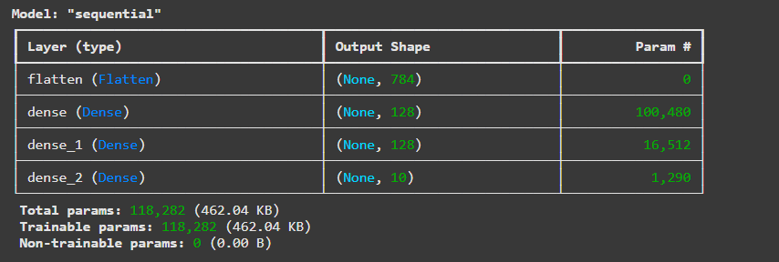
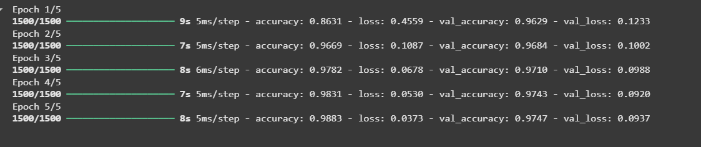
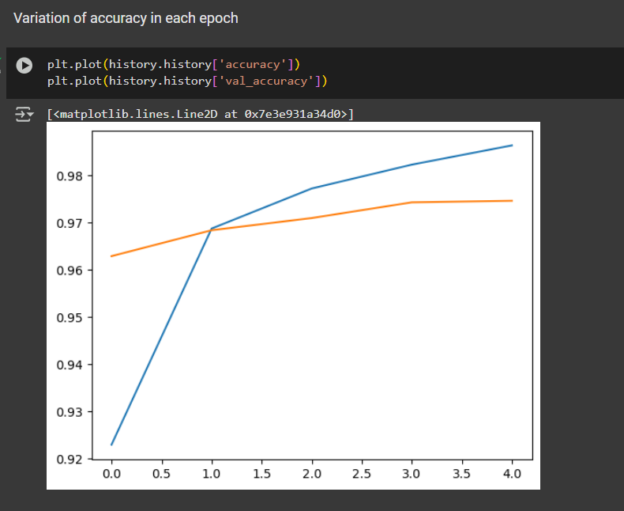
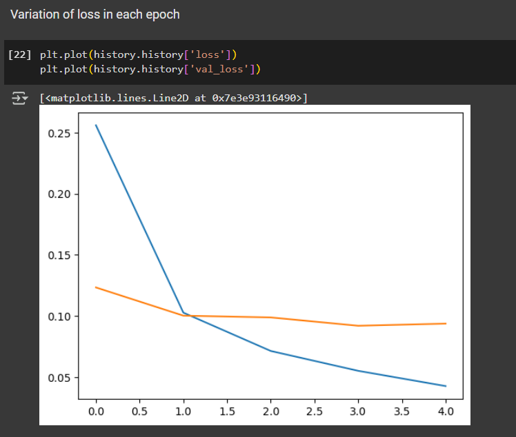
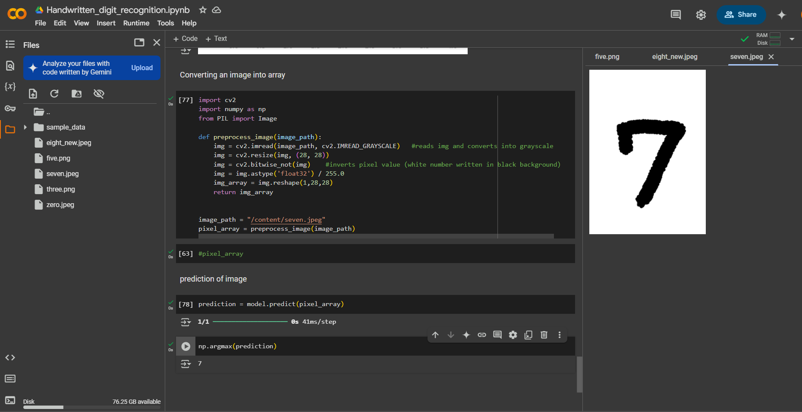

# Handwritten Digit Recognition using MNIST

## 📌 Project Overview
This project implements a **Handwritten Digit Recognition System** using a **Artificial Neural Network (ANN)** trained on the **MNIST dataset**. The model takes an image of a handwritten digit (0-9) as input and predicts the corresponding digit with high accuracy.

## 🏗 Tech Stack
- **Python**
- **TensorFlow**
- **CV**
- **Matplotlib**

## 📊 Dataset
The **MNIST dataset** consists of **60,000 training images** and **10,000 test images** of handwritten digits (0-9). Each image is **28x28 pixels**, grayscale, and labeled with the corresponding digit.

## Images

